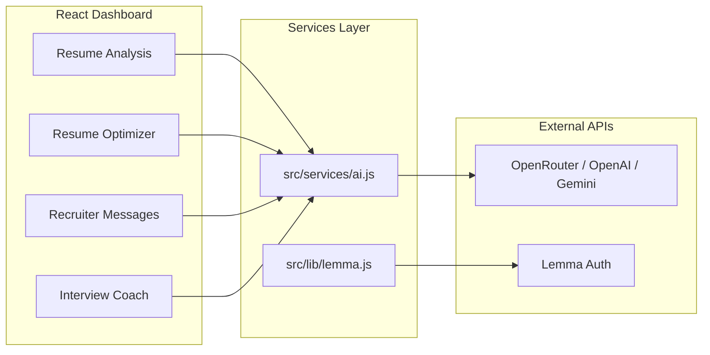

<div align="center">

# JobPilot AI

**Your AI co-pilot for every step of the job hunt — from resume to offer letter.**

[](https://react.dev/)
[](https://vitejs.dev/)
[](https://tailwindcss.com/)
[](https://lemma.work/)

[Live Demo](https://jobpilot-ai.apps.lemma.work) · [Report Bug](https://github.com/Jhananishri-B/JobPilot/issues) · [Request Feature](https://github.com/Jhananishri-B/JobPilot/issues)

</div>

---

## What is JobPilot AI?

JobPilot AI is a modern SaaS-style dashboard that helps job seekers **analyze resumes**, **optimize for ATS systems**, **craft recruiter outreach**, **prepare for interviews**, and **track applications** — all in one polished interface.

Built for hackathons and real-world use, it combines a premium React UI with flexible LLM integrations (OpenRouter, OpenAI, or Gemini) and Lemma-powered authentication and deployment.

---

## Table of Contents

- [Highlights](#-highlights)
- [Features](#-features)
- [Screens & Modules](#-screens--modules)
- [Architecture](#-architecture)
- [Tech Stack](#-tech-stack)
- [Quick Start](#-quick-start)
- [Environment Variables](#-environment-variables)
- [AI Providers](#-ai-providers)
- [Deploy with Lemma](#-deploy-with-lemma)
- [Project Structure](#-project-structure)
- [Design System](#-design-system)
- [Scripts](#-scripts)
- [Troubleshooting](#-troubleshooting)
- [Contributing](#-contributing)

---

## Highlights

| | |
|---|---|
| **End-to-end workflow** | Resume scoring → optimization → outreach → interview prep → pipeline tracking |
| **Provider-agnostic AI** | Works with OpenRouter, OpenAI, or Google Gemini — auto-detected from your API key |
| **Production-ready UX** | Loading states, skeleton loaders, validation, duplicate-submit protection, dark/light themes |
| **Lemma integration** | Secure auth via Lemma SDK; one-command deploy to `*.apps.lemma.work` |
| **Structured AI output** | Every feature returns typed JSON — scores, suggestions, messages, and question banks |

---

## Features

### Resume Analysis
Paste your resume and a target job description. AI returns:
- **ATS score** (0–100) with visual ring chart
- **Skill, keyword, education, and experience match** percentages
- Side-by-side **resume vs. required skills**
- **Resume summary**, hiring recommendation, and actionable improvement tips

### Resume Optimizer
Rewrite your resume for a specific role:
- **ATS-optimized resume** tailored to the job description
- **Added keywords** list for tracking what changed
- **Improvement summary** explaining the edits

### Recruiter Messages
Generate professional outreach in seconds:
- Personalized **subject line** and **message body**
- Configurable **tone** (professional, friendly, confident, etc.)
- Inputs: candidate name, company, role, and background summary

### Interview Coach
Prepare like you mean it:
- **HR questions** and **technical questions** for the role
- **Preparation topics** and a structured **preparation plan**
- **Interview tips** tailored to company and position

### Applications Tracker
Manage your job search pipeline locally:
- Kanban-style **status views** (Applied, Interview, Offer, Rejected)
- **Search and filter** by company, role, or status
- **CRUD operations** — add, edit, view details, delete applications
- Stats dashboard: total apps, interviews, offers, rejections

### Settings
Profile, notifications, security, billing, and integrations — full settings shell ready for extension.

---

## Screens & Modules

```
┌─────────────────────────────────────────────────────────────┐
│  Dashboard          Overview · stats · activity · actions   │
├─────────────────────────────────────────────────────────────┤
│  Resume Analysis    ATS score · match breakdown · tips      │
│  Resume Optimizer   Keyword injection · rewritten resume    │
│  Recruiter Messages AI-generated outreach emails            │
│  Interview Coach    HR + technical Q&A · prep plan            │
│  Applications       Pipeline CRUD · filters · analytics     │
│  Settings           Profile · prefs · security · billing      │
└─────────────────────────────────────────────────────────────┘
```

---

## Architecture



| Layer | Responsibility |
|-------|----------------|
| **Pages** | Form input, results display, local state |
| **`src/services/ai.js`** | LLM calls, provider detection, JSON parsing, error logging |
| **`src/lib/lemma.js`** | Lemma client for authentication |
| **`src/hooks/useFormSubmit.js`** | Validation, loading, error/success alerts |

---

## Tech Stack

| Category | Tools |
|----------|-------|
| **Framework** | React 19, React Router 7 |
| **Build** | Vite 6 |
| **Styling** | Tailwind CSS 3, Plus Jakarta Sans |
| **Icons** | Lucide React |
| **Data fetching** | TanStack React Query |
| **Auth & deploy** | Lemma SDK |
| **AI inference** | OpenRouter · OpenAI · Google Gemini |

---

## Quick Start

### Prerequisites

- **Node.js** 18+ (20+ recommended)
- An **AI API key** (OpenRouter, OpenAI, or Gemini)
- Optional: **Lemma account** for auth and cloud deploy

### 1. Clone & install

```bash
git clone https://github.com/Jhananishri-B/JobPilot.git
cd JobPilot
npm install
```

### 2. Configure environment

```bash
cp .env.example .env.local
```

Edit `.env.local` with your keys (see [Environment Variables](#-environment-variables)).

### 3. Run locally

```bash
npm run dev
```

Open **[http://localhost:5173](http://localhost:5173)** in your browser.

### 4. Build for production

```bash
npm run build
npm run preview   # optional — preview the production bundle
```

> **Note:** Vite inlines `VITE_*` variables at **build time**. Set all env vars before running `npm run build` for production deploys.

---

## Environment Variables

Create `.env.local` in the project root (never commit this file):

```env
# Lemma — authentication & deployment
VITE_LEMMA_API_URL=https://api.lemma.work
VITE_LEMMA_AUTH_URL=https://lemma.work/auth
VITE_LEMMA_POD_ID=your-lemma-pod-id

# AI — required for Resume Analysis, Optimizer, Messages, Interview Coach
VITE_AI_API_KEY=your-api-key-here

# Optional overrides (auto-detected if omitted)
# VITE_AI_PROVIDER=openrouter
# VITE_AI_API_URL=https://openrouter.ai/api/v1/chat/completions
# VITE_AI_MODEL=google/gemini-2.0-flash-001
```

| Variable | Required | Description |
|----------|----------|-------------|
| `VITE_LEMMA_API_URL` | For Lemma auth | Lemma API base URL |
| `VITE_LEMMA_AUTH_URL` | For Lemma auth | Lemma auth redirect URL |
| `VITE_LEMMA_POD_ID` | For Lemma deploy | Your Lemma pod ID |
| `VITE_AI_API_KEY` | For AI features | OpenRouter, OpenAI, or Gemini key |
| `VITE_AI_PROVIDER` | Optional | Force provider: `openrouter`, `openai`, `gemini` |
| `VITE_AI_API_URL` | Optional | Custom chat completions endpoint |
| `VITE_AI_MODEL` | Optional | Model ID (e.g. `gpt-4o-mini`, `google/gemini-2.0-flash-001`) |

---

## AI Providers

JobPilot auto-detects your provider from the API key prefix:

| Key prefix | Provider | Default endpoint |
|------------|----------|------------------|
| `sk-or-...` | **OpenRouter** | `openrouter.ai/api/v1/chat/completions` |
| `sk-...` (OpenAI) | **OpenAI** | `api.openai.com/v1/chat/completions` |
| `AIza...` | **Gemini** | `generativelanguage.googleapis.com` |

When debugging AI issues, open **DevTools → Console** and look for logs prefixed with `[JobPilot AI]` — they include request URL, body, status, and full error details.

---

## Deploy with Lemma

After building with your env vars set:

```bash
npm run build
lemma app deploy jobpilot-ai . --pod YOUR_POD_ID --dist-dir dist --yes
```

Your app will be live at:

**`https://jobpilot-ai.apps.lemma.work`**

Ensure `VITE_AI_API_KEY` is present during `npm run build` so the production bundle includes it.

---

## Project Structure

```
JobPilot/
├── public/                 # Static assets (favicon)
├── src/
│   ├── components/         # Layout, Navbar, Sidebar, UI primitives
│   ├── config/             # Navigation routes
│   ├── context/            # Theme (dark/light)
│   ├── hooks/              # useFormSubmit — validation & submit flow
│   ├── lib/                # Lemma client
│   ├── pages/              # Dashboard + 6 feature pages
│   ├── services/           # ai.js — all LLM integration
│   └── utils/              # Form validation helpers
├── app.json                # Lemma app manifest
├── .env.example            # Env template (safe to commit)
├── vite.config.js
├── tailwind.config.js
└── package.json
```

---

## Design System

| Token | Value | Usage |
|-------|-------|-------|
| **Primary** | `#6366F1` (Indigo) | Buttons, links, active nav |
| **Accent** | `#10B981` (Emerald) | Success states, high scores |
| **Surface** | Glassmorphism cards | Content panels |
| **Radius** | 16px | Cards, inputs, modals |
| **Theme** | Dark default + light toggle | System-wide via `ThemeContext` |

Responsive layout: fixed sidebar on desktop, bottom mobile nav, collapsible sections, smooth hover and transition animations throughout.

---

## Scripts

| Command | Description |
|---------|-------------|
| `npm run dev` | Start Vite dev server (port 5173) |
| `npm run build` | Production build → `dist/` |
| `npm run preview` | Serve production build locally |

---

## Troubleshooting

<details>
<summary><strong>AI returns an error or empty response</strong></summary>

1. Confirm `.env.local` exists and `VITE_AI_API_KEY` is set.
2. Restart the dev server after changing env vars.
3. Check the browser console for `[JobPilot AI]` logs.
4. Verify your API key matches the provider (OpenRouter keys need OpenRouter endpoint).
5. For production, rebuild with env vars set before deploy.

</details>

<details>
<summary><strong>Lemma auth not working locally</strong></summary>

Ensure all three Lemma variables are set in `.env.local` and that `AuthGuard` in `src/main.jsx` wraps the app with your pod ID.

</details>

<details>
<summary><strong>Build succeeds but deploy has no AI</strong></summary>

Vite bakes env vars at build time. Run `npm run build` with `VITE_AI_API_KEY` exported, then redeploy.

</details>

---

## Contributing

Contributions are welcome! To get started:

1. Fork the repo
2. Create a feature branch (`git checkout -b feature/amazing-feature`)
3. Commit your changes
4. Push and open a Pull Request

Please do **not** commit `.env.local` or API keys.

---

<div align="center">

**Built with React, Vite, Tailwind, Lemma, and your favorite LLM.**

[⭐ Star this repo](https://github.com/Jhananishri-B/JobPilot) if JobPilot AI helps you land your next role.

</div>
